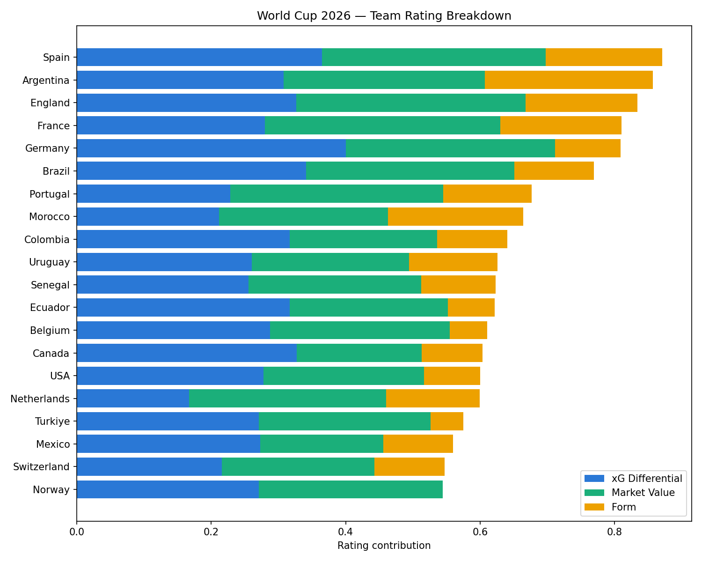
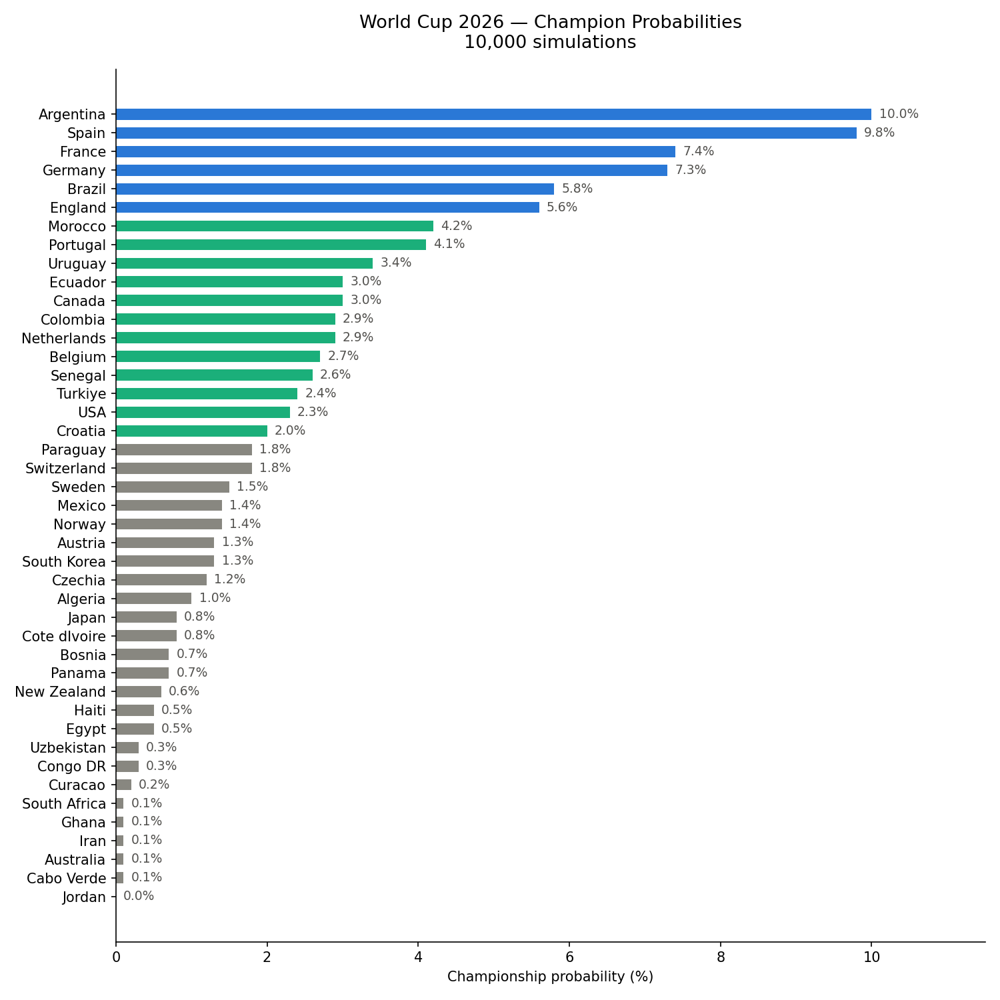

# World Cup 2026 Predictor

A Monte Carlo simulation engine that predicts the 2026 FIFA World Cup using a custom rating system built from real football data. Run it once and you get a single result. Run it 10,000 times and you get probabilities.

---

## Why I Built This

I work in football and I wanted to build something that combined my interest in the sport with the data and ML skills I'm developing. A World Cup predictor felt like the right project for a few reasons! It's got a clear output, real data you can argue about, and enough complexity to be interesting.

---

## How It Works

Every team gets a rating built from three factors:

**xG Differential** — Expected goals scored minus expected goals conceded per game, averaged across the 2018 and 2022 World Cups. This strips out luck and measures how well a team actually played, not just whether they won.

**Squad Market Value** — Total Transfermarkt squad value, log-scaled to stop the gap between elite and mid-tier nations from dominating everything else. This captures raw talent in a way match results alone can't.

**Tournament Form** — Points earned across the last two major tournaments per confederation (World Cup + Euros/Copa America/AFCON etc). Rewards teams that consistently perform on the big stage.

These three combine into a single rating:

Rating = (0.40 x xG Differential) + (0.35 x Market Value) + (0.25 x Form)

The weights were chosen based on reasoning and validated through backtesting — more on that below.

Once every team has a rating, matches are simulated using a Poisson distribution. If a team is expected to score 1.4 goals, the model samples from Poisson(1.4) to get the actual scoreline. Do that once and you get one possible version of the tournament. Do it 10,000 times and you get a probability distribution.

Drawn knockout games go to penalties. Rather than a coin flip, each team has a historical shootout win rate based on their record in major tournaments. England's 30% win rate hurts them. Argentina's 75% helps them.

---

## Three Simulation Modes

Mode 1 — Pre-tournament

Simulates everything from scratch. All 12 groups play out, the best third-place teams qualify, then the full knockout bracket runs. Useful for pre-tournament predictions.

Mode 2 — Round of 32

This simulates the Round of 32 all the way until the winner with predicted probabilities.

Mode 3 - Real time simulation

This is the Live setting. All the real-time results are updated by me and the model will give live feedback on probabilities on the remaining teams left.

## Backtesting

I ran the model against the 2022 World Cup knockout stage to see how well it predicted. Using the real Round of 16 bracket, Argentina came out as 3rd most likely at 8.9%. France with 2nd highest at 12.1% probability won the competition. 

Brazil                22.2%   
France                12.1%   
Argentina              8.9%   

Not perfect — Croatia and Morocco were underrated despite reaching the semi-finals — but the model correctly identified the winner and finalist, which is a decent result for three input factors.

---

## Visualisations

### Team Rating Breakdown

### Champion Probabilities

## Project Structure

data/
    teams.csv          - 49 teams with xG diff, market value, form
    penalties.csv      - Historical shootout records per team

ratings.py             - Normalisation + composite rating calculation
simulation.py          - Poisson match sim + penalty shootout logic
tournament.py          - Group stage round-robin logic
monte_carlo.py         - Group-level probability engine
main.py                - Full tournament simulation (2 modes)
backtest.py            - 2022 World Cup validation

---

## How to Run

pip install pandas numpy scipy scikit-learn
python main.py

You will be prompted to choose a mode. Results print to the terminal with a simple bar chart.

---

## Known Limitations

- xG data is not available before 2018. Teams missing from both tournaments use their confederation average as a proxy, which is a rough estimate.

- Penalty records are based on limited samples. Teams with no shootout history default to 50/50.

- Home advantage for the three co-hosts (USA, Canada, Mexico) is not currently modelled.

- Squad injuries, suspensions and managerial changes are not captured. The model is a pre-tournament snapshot, not a live one.

---

## Data Sources

- xG data — FBRef (2018 and 2022 World Cups)
- Market values — Transfermarkt (2025)
- Tournament form — Wikipedia / official confederation records
- Penalty records — RSSSF / Wikipedia

---

## 2026 World Cup Backtest

Once the 2026 tournament finished, I scored the model's win probabilities against all 32 real knockout matches (Round of 32 through the Final) to check calibration, not just accuracy.

- **Correct favourite picked:** 24/32 (75.0%)
- **Brier score:** 0.186 (0 = perfect, 0.25 = coin-flip guessing)
- **On confident calls only** (excluding 7 matches within 4 points of 50/50): 20/25 correct (80.0%)

Strongest at the middle rounds — Quarter-finals went 4/4, Round of 32 was 13/16 — where xG and market value gaps between teams are real and measurable. Weakest at the business end: Semi-finals, Final and third-place all scored around coin-flip level, largely because by that stage every team left is genuinely close in quality (the Final gave Spain 49.3%, and Spain won 1-0 in extra time). The third-place playoff was the one true outlier (worse than guessing) — squad rotation and motivation there sit outside what the model can capture.

Biggest misses (Paraguay over Germany, Norway over Brazil, Switzerland over Colombia, Mexico over Ecuador) were mostly penalty shootouts or teams on an in-tournament form spike — Norway's Haaland-driven run being the clearest example of something a backward-looking rating can't see coming.

## What I Would Improve Next

- Add an in-tournament form signal — rolling xG over-performance from a team's own matches this tournament, to catch runs like Norway's that a pre-tournament rating misses
- Source qualifying campaign xG for the 21 teams currently on confederation averages
- Add recency weighting so 2022 counts more than 2018 in the xG calculation
- Model home advantage for co-host nations
- Build a Streamlit dashboard so the output is visual rather than terminal text
- Run a proper weight optimisation using grid search across backtested tournaments (2022 and 2026 both now available)
